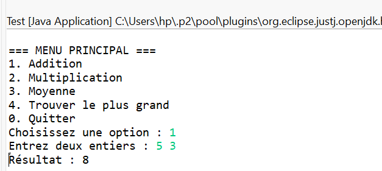

# TP1 - Opérations Mathématiques en Java

## Description
Ce projet **TP1** est une application Java en mode console qui permet d’effectuer plusieurs opérations mathématiques simples à partir d’un menu interactif.

##  Fonctionnalités
- Addition de deux entiers  
- Multiplication de deux entiers  
- Calcul de la moyenne d’un ensemble de valeurs  
- Recherche du nombre maximum parmi plusieurs valeurs  

## Exécution du programme
1. Ouvrir le projet **TP1** dans **Eclipse** (ou tout autre IDE Java).  
2. Vérifier que le fichier `Test.java` se trouve dans le package `projet1`.  
3. Exécuter le programme (`Run`).  
4. Suivre les instructions affichées dans le menu :
   - Entrer deux nombres pour addition/multiplication.  
   - Saisir plusieurs valeurs pour calculer la moyenne ou le maximum.  
   - Entrer `0` pour quitter.

## Exemple d’exécution
```bash
=== MENU PRINCIPAL ===
1. Addition
2. Multiplication
3. Moyenne
4. Trouver le plus grand
0. Quitter
Choisissez une option : 1
 Entrez deux entiers : 5 3
 Résultat : 8
```
Voici un exemple de l'exécution du programme (screenshot) :



